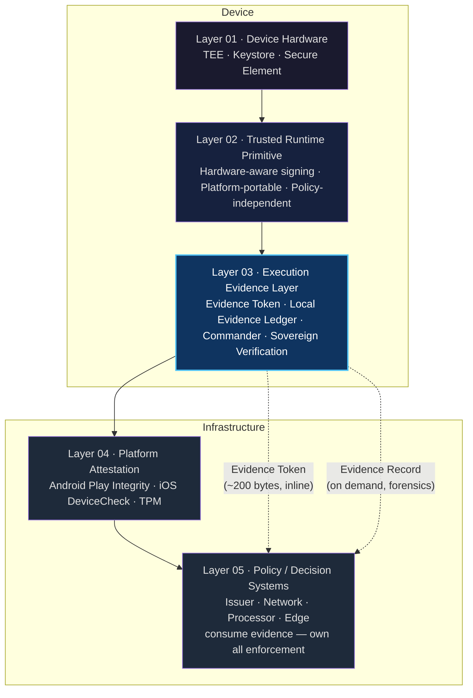
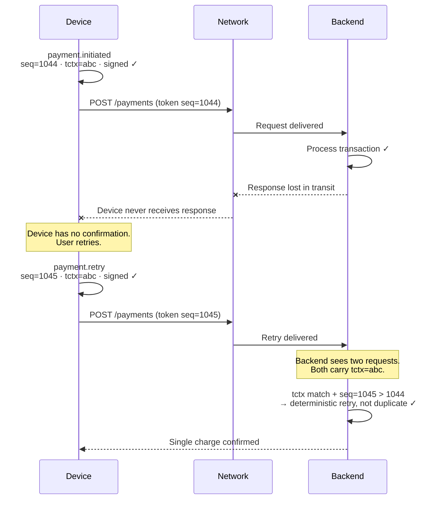
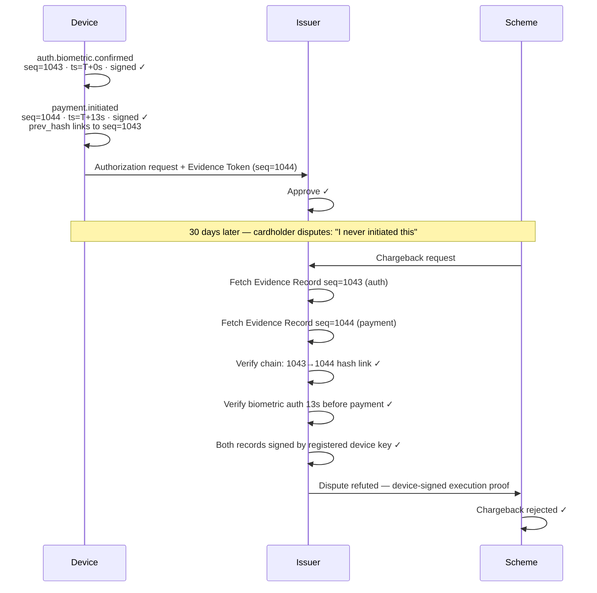
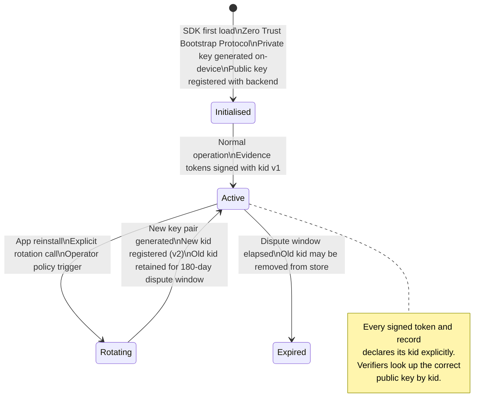
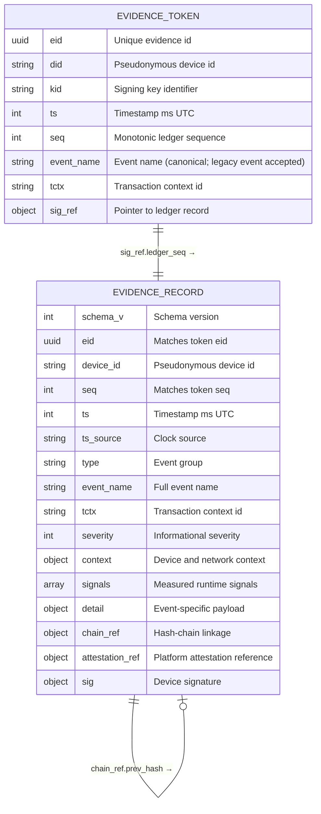
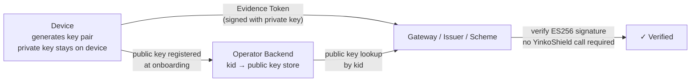

# YinkoShield Evidence Token Specification

> **Status:** Published · v1.0 · March 2026 - Maintained by Yinkozi (see [`SPEC.md`](SPEC.md))


This repository defines the **YinkoShield Evidence Token** format and provides reference verifier implementations in four languages. It is the public specification for integrators building evidence consumption into payment gateways, issuers, risk engines, and dispute systems.

**Operator pack:** [`CONFORMANCE.md`](CONFORMANCE.md) (checklists + CI) · [`THREAT_MODEL.md`](THREAT_MODEL.md) (informative threat analysis)

---

## Overview

The Execution Evidence Infrastructure (EEI) defines a standardised approach to capturing, structuring, and transporting device-level execution evidence.

It is designed to provide a reliable and verifiable representation of what actually occurred on a device during a sensitive interaction, independently of detection techniques or enforcement mechanisms.

---

## What this is

Payment transactions produce a gap between what the device executed and what the backend observed. When connectivity fails, when a retry arrives, when a dispute is filed — the backend can only infer what happened on the device. YinkoShield fills this gap with a device-signed, cryptographically verifiable execution record that travels with the payment message.

Two shapes of evidence are defined:

| Shape | Size | When used |
|---|---|---|
| **Evidence Token** | ~200–300 bytes JWS | Per-transaction, inline with every request — HTTP headers, ISO 8583 DE 48, message metadata |
| **Evidence Record** | Full JSON | On-device ledger, fetched on demand for dispute, fraud investigation, or audit |

The token carries a pointer (`sig_ref`) to the corresponding ledger record. Fetch the record only when you need dispute-grade detail.

---

## Architecture



Layers 02 and 03 are **additive**. They do not modify or replace any existing layer.

---

## Verification pipeline

The **8-step** pipeline every compliant verifier must implement (SPEC.md — steps fail closed):

```mermaid
flowchart TD
    A([Token received]) --> B[1 · Parse JWS\nSplit header.payload.sig\nDecode Base64URL]
    B --> C{alg and kid\npresent?}
    C -- No --> R1([REJECT])
    C -- Yes --> D[2 · Resolve key\nLookup kid in key store]
    D --> E{Key found?}
    E -- No, attempt re-fetch --> F{Re-fetch\nsucceeded?}
    F -- No --> R2([REJECT unknown kid])
    F -- Yes --> G
    E -- Yes --> G[3 · Verify signature\nES256 over header.payload]
    G --> H{Signature\nvalid?}
    H -- No --> R3([REJECT])
    H -- Yes --> I[4 · Validate claims\nRequired fields · UUID · type checks]
    I --> J{All fields\npresent and valid?}
    J -- No --> R4([REJECT])
    J -- Yes --> K[5 · Enforce freshness\nabs&#40;now − ts&#41; ≤ window]
    K --> L{Within\nwindow?}
    L -- No --> R5([REJECT])
    L -- Yes --> M[6 · Deduplicate\ndid + tctx + event_name + seq]
    M --> N{Seen\nbefore?}
    N -- Yes --> R6([REJECT duplicate])
    N -- No --> O[7 · Retry correlation\nMonotonic seq within tctx]
    O --> P{Sequence\nregression?}
    P -- Yes --> R7([REJECT])
    P -- No --> Q[8 · Trust level\nfrom linked Evidence Record\nor SOFTWARE_LAYER]
    Q --> T([VALID · claims + trust level])

    style T fill:#1b5e20,color:#ffffff
    style R1 fill:#7f0000,color:#ffffff
    style R2 fill:#7f0000,color:#ffffff
    style R3 fill:#7f0000,color:#ffffff
    style R4 fill:#7f0000,color:#ffffff
    style R5 fill:#7f0000,color:#ffffff
    style R6 fill:#7f0000,color:#ffffff
    style R7 fill:#7f0000,color:#ffffff
```



---

## Ghost transaction scenario

The canonical connectivity failure that motivates this format:



Without execution evidence, the backend must guess. With it, retry correlation is deterministic.

---

## Dispute resolution scenario



> **Illustrative only.** Outcomes depend on **scheme rules, issuer policy, and jurisdiction**. EEI provides **integrity-bound execution evidence**; it does **not** assign **liability** or replace **3-D Secure / CAVV** unless a program explicitly says so. See [`SPEC.md`](SPEC.md) (disputes section) and [`THREAT_MODEL.md`](THREAT_MODEL.md).

---

## Key lifecycle



---

## Token and record relationship



---

## Trust levels

| Level | Condition | Policy guidance |
|---|---|---|
| `hardware_backed` | `attestation_ref.device_state = verified` | Accept for high-value transactions and dispute evidence |
| `hardware_bound` | `attestation_ref.device_state = hardware_keystore` | Hardware-backed key; no full TEE attestation chain |
| `execution_proof` | `attestation_ref.device_state = unknown` | Platform state indeterminate; apply additional checks |
| `compromised_device` | `attestation_ref.device_state = failed` | Evidence recorded; device integrity failed |
| `software_layer` | No `attestation_ref` present | No platform binding; policy weight is operator-defined |

Trust level is a **declared property** of the evidence. YinkoShield does not enforce policy. All accept, reject, and scoring decisions remain with the consuming system.

---

## Quick start

### Embed the token (REST)

```http
POST /v1/payments/authorize HTTP/1.1
X-YinkoShield-Evidence: eyJhbGciOiJFUzI1NiIsImtpZCI6Inlpbmtvc2hpZWxkLmRldmljZS5zaWduLnYxIiwidHlwIjoiSldTIn0...
Content-Type: application/json

{"amount": "4200.00", "currency": "ZAR", "merchant_id": "..."}
```

### Verify the token (Python)

```python
# Run from the repo root
from verifier import EvidenceTokenVerifier, KeyStore  # when in verifiers/python/
# or: sys.path.insert(0, 'verifiers/python'); from verifier import ...

store = KeyStore()
store.load_pem("yinkoshield.device.sign.v1", "keys/demo_public_key.pem")

verifier = EvidenceTokenVerifier(store)
result = verifier.verify(token_string, skip_freshness=True)  # skip_freshness for static fixtures
if result:
    print(result.claims["event_name"])  # e.g. "payment.initiated" (legacy "event" normalised here)
    print(result.trust_level)           # TrustLevel.SOFTWARE_LAYER (until record fetched)
```

### Run all tests

Use **Python 3.9+** (`python3`). On PEP 668–managed systems, create a venv first:

```bash
# Python (96 tests) — cryptography + pytest
cd verifiers/python && python3 -m venv .venv && . .venv/bin/activate
pip install cryptography pytest
pytest tests/test_verifier.py -v

# JavaScript (87 tests, no dependencies; run from repo root)
node --test verifiers/javascript/tests/test_verifier.test.js

# Go (full package; run from repo root)
cd verifiers/go && go test ./... -v

# Java (53 tests; EvidenceTokenVerifier + EvidenceRecordVerifier)
cd verifiers/java && mvn test
```

---

## Repository structure

```
yinkoshield-eei-spec/
├── SPEC.md                          # Normative format specification (v1.0)
├── CONFORMANCE.md                   # Checklists, CI commands, sign-off template
├── THREAT_MODEL.md                  # Informative threat analysis
├── AGENTIC_PAYMENT_EXTENSION.md     # Forward design note — EEI v2.0 Agentic Profile (non-normative)
├── CHANGELOG.md                     # Specification and documentation history
├── LICENSE                          # Custom
├── SECURITY.md                      # Vulnerability reporting policy
├── keys/
│   ├── demo_public_key.pem          # Demo public key — for verifying examples
│   ├── demo_public_key.jwk.json     # Same key in JWK format
│   └── README.md                    # ⚠ Demo key notes — never use in production
├── examples/
│   ├── full_evidence_record.json    # Fully signed Evidence Record
│   ├── demo_sequence/               # Ghost transaction scenario (2 attempts)
│   └── chargeback_dispute/          # Dispute resolution scenario (auth→payment chain)
├── verifiers/
│   ├── python/                      # Python ≥3.9 · dependency: cryptography
│   ├── javascript/                  # Node.js ≥18 · zero external dependencies
│   ├── go/                          # Go ≥1.21 · zero external dependencies
│   └── java/                        # Java ≥17 · zero runtime dependencies
└── test-vectors/
    ├── valid/                        # 3 positive test cases
    └── invalid/                      # 20 negative test cases across 7 attack categories
```

The **verifier** directories are **reference implementations** for interoperability testing and learning. They are **not** a supported production SDK or gateway product; embed or fork them under your own security and maintenance lifecycle.

---

## Integration: ISO 8583

The Evidence Token (Minimal Profile, ~200 bytes as UTF-8) embeds directly into ISO 8583 authorization messages. DE 48 (Additional Data / Private Use) accommodates up to 999 bytes, providing ample headroom for the token plus any co-resident subelements.

**Encoding:** The specific subelement tag and framing must be agreed with your acquirer and scheme. A common convention for private extensions is:

```
DE 048  Additional Data (Private Use)
  Subelement ID:  agreed with acquirer (e.g. SE99 or a private-range TLV tag)
  Length:         UTF-8 byte count of the JWS string (2 bytes, binary)
  Value:          JWS compact string (UTF-8, no padding or newlines)
```

> **Important:** Mastercard, Visa, and other schemes define their own DE 48 subelement registries. YinkoShield does not prescribe a specific subelement ID. Coordinate with your scheme and acquirer to reserve a subelement slot. Do not use tags reserved by the scheme for other purposes.

The token travels through the authorization flow unchanged. The issuer or scheme risk engine extracts it from DE 48, verifies the ES256 signature against the registered device public key (sovereign verification — no YinkoShield backend required), and uses the claims to enrich the authorization decision.

---

## Sovereign verification

The verification model requires **no YinkoShield-operated infrastructure** at verification time:

1. During device onboarding, the backend registers `kid → public key` for each device
2. The device signing key (EC P-256) is generated on-device; the private key never leaves the device
3. Any party that can store a public key and verify an ES256 signature can verify evidence independently
4. Key rotation produces a new `kid`; the old key is retained for the dispute window (minimum 180 days)



---

## Security test vectors

The `test-vectors/invalid/` directory contains 20 adversarial cases across 7 categories. Any compliant verifier must reject all of them:

| Category | Vectors | What is tested |
|---|---|---|
| `signature_forged` | 4 | Wrong key, corrupted bytes, empty signature, unknown kid |
| `algorithm_confusion` | 2 | HS256 claim, alg=none |
| `expired_token` | 2 | 1-hour-old token, future-dated token |
| `replay_attack` | 1 | Same valid token submitted twice |
| `missing_fields` | 8 | One per required Minimal Profile field |
| `sequence_regression` | 1 | Retry with seq lower than prior attempt |
| `broken_chain` | 2 | Tampered prev_hash, modified record content |

Trust-level evaluation (hardware_backed, execution_proof, compromised_device, software_layer) is covered by dedicated tests in each verifier's test suite rather than separate JSON vectors, as trust level is a property of the linked Evidence Record rather than a token-level rejection condition.

See [`test-vectors/README.md`](test-vectors/README.md) for the full catalogue.

---

## Specification

| Document | Role |
|----------|------|
| [`SPEC.md`](SPEC.md) | Normative format and verification rules (v1.0). |
| [`CONFORMANCE.md`](CONFORMANCE.md) | Verifier / producer checklists, CI commands, sign-off template. |
| [`THREAT_MODEL.md`](THREAT_MODEL.md) | Informative STRIDE-style analysis, pitfalls, review questions. |
| [`SECURITY.md`](SECURITY.md) | How to report security vulnerabilities responsibly. |
| [`AGENTIC_PAYMENT_EXTENSION.md`](AGENTIC_PAYMENT_EXTENSION.md) | Forward design note for EEI v2.0 Agentic Profile — delegation chains, agent identity claims, scope binding. Not normative. |

[`SPEC.md`](SPEC.md) covers Evidence Token and Evidence Record definitions, signal and event registries, key lifecycle, production limits and binding, integration and privacy profiles, offline/freshness policy, and dispute / liability framing (informative).

The agentic payment extension (`AGENTIC_PAYMENT_EXTENSION.md`) is a forward design note for the **v2.0 roadmap**. It uses the same JWS compact format and ES256 crypto as v1.0 — the extension is fully additive (`schema_v: 2`, optional `agent` block). No changes to existing integrations are required.

---

## Architecture reference

For the full architecture reference — including the Trusted Runtime Primitive, Runtime Coherence, policy-execution decoupling, and production deployment characteristics — see the YEI-001 Architecture Reference document, available to qualified integration partners.

---

## Contributing and security

- **Specification feedback:** open a discussion or issue in this repository (or follow your organisation’s contribution process if this is a fork).
- **Security vulnerabilities:** follow **[`SECURITY.md`](SECURITY.md)** — use **GitHub Security Advisories** (or the maintainer contact listed there), not public issues.

Patches to reference verifiers should preserve parity with `SPEC.md` and keep all four language test suites green.

---

## License

Reference implementations are maintained by Yinkozi. See [`LICENSE`](LICENSE).  

